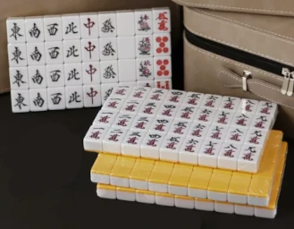
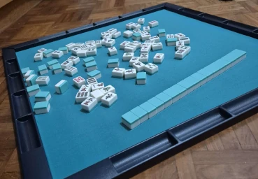
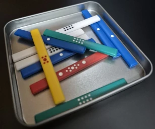
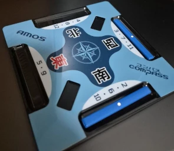
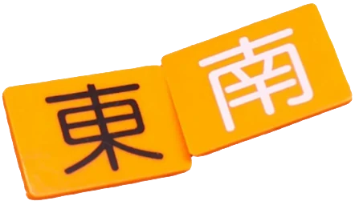

# Playing IRL

If you get the chance, definitely try playing in real life!

Most online clients come with "hints" or "tips", such as calculating your waits at tenpai.
But if you play in person, you are on your own, and it makes the game much more thrilling!

## Local clubs

Look for nearby riichi mahjong clubs using the [World Riichi Map](https://jellicodemahjong.wordpress.com/world-riichi-map/).

## Equipment

Here is a list of equipment commonly found in riichi mahjong, ordered from most to least essential.

> [!NOTE]
> Pictures of the equipment are included for reference only.
> I am not sponsored or affiliated with any of these brands.

### Tiles

Riichi mahjong is played with 136 tiles.
If you are playing with "red five" tiles, make sure your mahjong set comes with those.

### A smooth surface

You need a smooth surface to play on.
Shuffling the tiles on a rough surface can easily scratch your tiles.

It is highly recommended to get a mahjong mat or a mahjong table.

### Point sticks (tenbou)

Tenbou are the "currency" sticks to track your points in riichi mahjong.

They are good-to-have, but you can also use apps or pen and paper to keep track of everyone's points.

### Compass

A riichi mahjong compass can be handy to keep track your seat wind.
They often have slots to hold your riichi sticks for declaring riichi.

It is convenient but not necessary to use a compass, as long as everyone can keep track of their seat winds.

### Round indicator

A round indicator tracks the current round wind.
It is usually a piece of plastic with "East" printed on one side and "South" on the other.

### Dice

A pair of dice is used to determine several things, such as the initial dealer and where to break the wall.

### Cheat sheet

You can also consider bringing a riichi mahjong cheat sheet if you are new.
