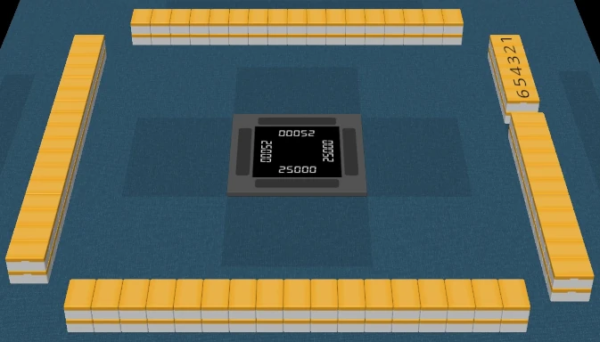
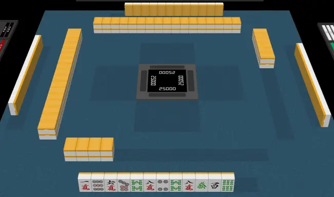

# Start of a hand

Finally, it is time to play!
This section covers how each hand begins.

## Shuffling the tiles

You should shuffle the tiles by pushing them from the sides.
Avoid placing your hands on top of the tiles!

If you are lucky enough to play on an automatic table, you get to skip this part!

## Building the walls

After shuffling, every player builds their own wall, **2** tiles high and **17** tiles wide.

> [!TIP]
> Don't worry about stacking 17 tiles in one go.
> There is no shame in doing it bit by bit.

## Breaking the wall

The dealer rolls 2 dice and takes the sum.
Starting with the dealer as 1, count anti-clockwise to determine whose wall will be broken.

| Player | Sum |
| --- | --- |
| East (dealer) | 1, 5, 9 |
| South | 2, 6, 10 |
| West | 3, 7, 11 |
| North | 4, 8, 12 |

> [!TIP]
> You can also find these numbers on your mahjong compass!

The chosen person uses the same sum and counts from the right end of their wall.
The wall is broken at that spot.

The example below illustrates what happens when the sum is **6**.

Since the sum is **6**, the chosen player is **South**.
This means the break happens at **South's** wall, **6** from the right.

## Distributing initial hand

The live wall starts to the **left** of the break point.

Starting from the dealer and moving anti-clockwise, each player takes two stacks (4 tiles) from the live wall.
Repeat this step until all players have 12 tiles.

Afterwards, draw the final tiles as shown below:

The dealer starts with 14 tiles while the remaining players start with 13 tiles.

> [!WARNING]
> There are high-end automatic tables that deal starting hands to players.
> However, these tables always deal 13 tiles to everyone.
> The dealer must remember to draw one tile to start their hand with 14!
