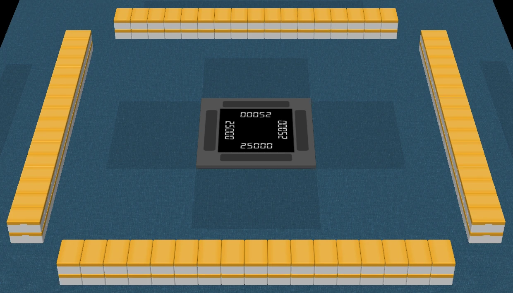
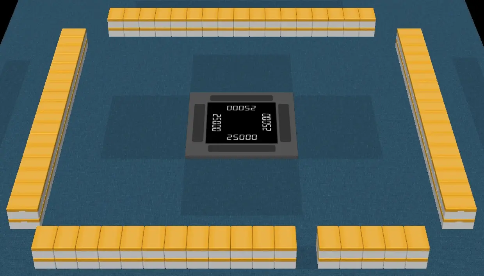
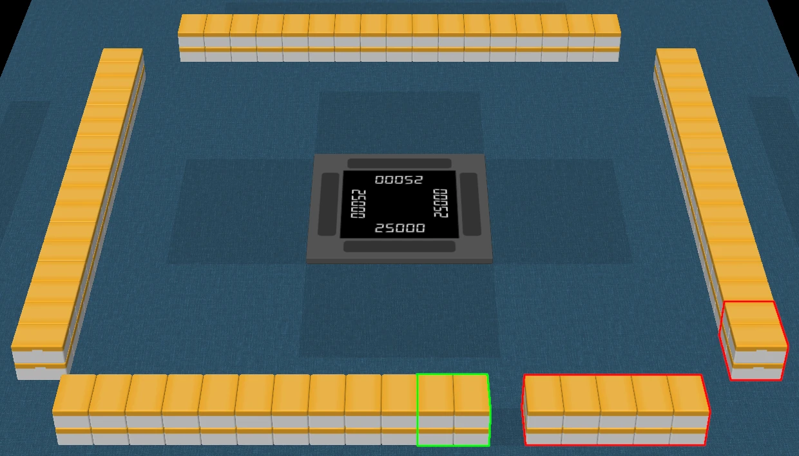
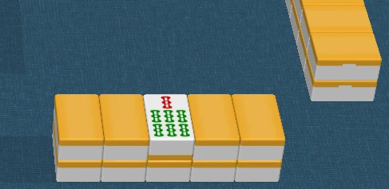
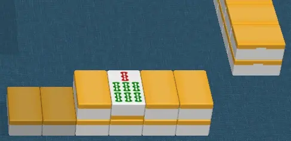
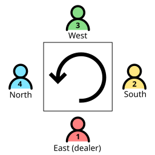
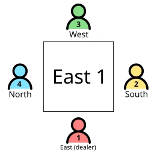

# What is riichi mahjong?

Riichi mahjong (or Japanese mahjong) is the Japanese variant of the mahjong game.

## Tiles

Riichi mahjong is played with 136 tiles. There are 34 kinds of tiles, 4 copies each.

Tiles are mainly categorized into **number** tiles and **honor** tiles.

### Number tiles

There are 27 kinds of number tiles: 9 characters, 9 dots and 9 bamboos.

#### Characters (manzu)

```mj
123456789m
```

#### Dots (pinzu)

```mj
123456789p
```

#### Bamboos (souzu)

```mj
123456789s
```

### Honor tiles

There are 7 kinds of honor tiles: 4 winds and 3 dragons.

#### Winds

The 4 kinds of winds are East, South, West and North.

```mj
1234z
```

#### Dragons

The 3 kinds of dragons are White, Green and Red.

```mj
567z
```

### Special tiles

In some rulesets, "red five" tiles are used.
These tiles give bonus points for your hand.

```mj
0555m _ 0555p _ 0555s
```

## Tile groups

A typical winning hand consists of 4 **melds** and a **pair**.

### Meld

Melds can either be sequences or triplets.

#### Sequences

Sequences are formed with 3 consecutive number tiles of the same suit.

```mj
123m_678p_345s
```

#### Triplets

Triplets are formed with any 3 identical tiles.

```mj
333s_222z_555z
```

#### Quads

Quads are formed with any 4 identical tiles.
Quads generally function as triplets.

```mj
4444p _ 1111s
```

### Pair

Pairs are just... pairs.

```mj
99m_55p_77z
```

### Example

```mj
555m11789p234s444z
```

The four melds and one pair are:
- Meld #1: `mj 555m`
- Meld #2: `mj 789p`
- Meld #3: `mj 234s`
- Meld #4: `mj 444z`
- Pair: `mj 11p`

## Initial setup

The following screenshots are taken from [Autotable](https://pwmarcz.pl/autotable/), a riichi mahjong table simulator.

The initial **wall** has four sides, each made of stacks **2** tiles high and **17** tiles wide.



### Breaking the wall

A player then rolls the dice to determine where to break the wall.



The **dead wall** consists of **14** tiles (highlighted in red) to the **right** of the break point.

The rest of the wall is the **live wall**, where players take turns drawing tiles. Draws begin at the tiles (highlighted in green) to the **left** of the break point and move clockwise.



### The dead wall

The third tile on the top row is revealed.



> [!NOTE]
> This tile serves as the **dora indicator**.
> It is explained in the later sections.

It is also customary for the first tile on the top row to be shifted down.



## Seats and Rounds

Riichi mahjong is a 4-player game.
The **seats** of the players are assigned winds: East, South, West, North, in an anti-clockwise order.
The player seated East is the **dealer**.



Riichi mahjong games are structured around a series of **rounds**.
**Rounds** are also assigned winds.

A match is commonly played over 1 or 2 **rounds**:
- Tonpuusen: **east round** only
- Hanchan: **east round** and **south round**

The **seats** rotate as the **round** goes. The **round** ends when the **seats** have rotated 4 times.


